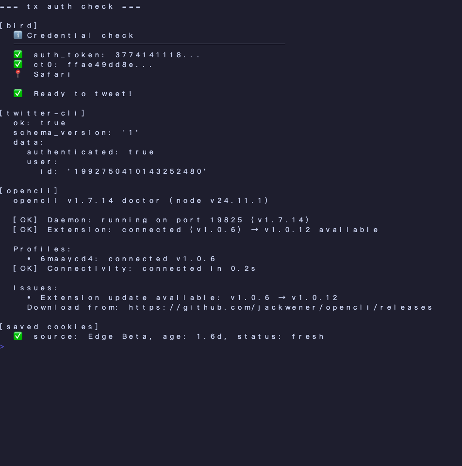
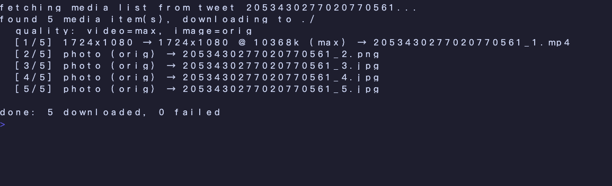

# magpie 🐦


> **Unified macOS CLI for X/Twitter + 132 sites.** One router across [`twitter-cli`](https://github.com/public-clis/twitter-cli) (TLS-impersonating GraphQL), [`bird`](https://github.com/steipete/bird) (fallback for unique cmds), and [`opencli`](https://github.com/jackwener/opencli) (browser automation + 132 site adapters). Drop-in alternative to `ve-twini` with full coverage of all 200+ commands. Magpies hoard shiny things — so does this one.


<table>
<tr>
<td width="50%"></td>
<td width="50%"></td>
</tr>
<tr>
<td><sub><code>tx auth</code> — health check across <b>bird</b> + <b>twitter-cli</b> + <b>opencli</b>, plus cookie freshness</sub></td>
<td><sub><code>tx download</code> — fetches max-bitrate video (1080p @ 10 Mbps) and original-resolution images from a single tweet URL</sub></td>
</tr>
</table>

```bash
tx search "Claude Code"        # → twitter-cli (TLS impersonation, best for X reads)
tx post "hello world"          # → twitter-cli (1.5-4s write jitter built-in)
tx like https://x.com/.../...  # → twitter-cli
tx mentions                    # → bird (only bird has clean mentions filter)
tx block @spam_user            # → opencli (browser-only operation)
tx arxiv search "vision"       # → opencli arxiv adapter
tx archive                     # incremental SQLite sync of X bookmarks (via twitter-cli)
tx download --tweet-url <url>  # max-quality video/image grab (via bird variants)
```

Single ~800-line Python file, **zero pip dependencies**, **3-backend routing** with automatic priority.

---

## Why

| Pain | Solution |
|---|---|
| `bird` covers X but lacks TLS-level anti-detection. `twitter-cli` has it but lacks `mentions`/`news`. `opencli` covers 132 sites and DM/block ops nothing else has. | One unified `tx` calling each for what it's best at |
| Hand-coding wrappers for every command means upgrades break things. | All commands auto-discovered from each tool's `--help` output |
| At extreme usage volumes, browser-driven writes (5-15s each) become unusable. Plain HTTPS (bird) gets fingerprinted. | Default writes via **twitter-cli** (1.5-4s + TLS impersonation + jitter) |
| Safari's ITP kills cookies after 7-30 days. Cron jobs can't read encrypted browser cookies. | One-time extraction → `~/.tx/cookies.env` (Edge Beta cookies last ~13 months) |
| Cookie expiration is silent — you find out weeks later your archive is broken. | `tx auth` shows fresh / aging / stale / expired status with renewal hints |

---

## Install

### Prerequisites

```bash
# 1. Node-based upstream tools (bird = fallback for unique cmds; opencli = browser + 132 sites)
npm install -g @steipete/bird @jackwener/opencli

# 2. Python-based primary X backend (TLS impersonation)
uv tool install twitter-cli      # or: pipx install twitter-cli

# 3. Python 3.10+ for magpie itself (stdlib only, no pip deps)
python3 --version
```

### Install magpie

```bash
git clone https://github.com/BuddhaYi/magpie.git
cd magpie
./install.sh                 # symlinks tx → /usr/local/bin (or ~/.local/bin)
tx --help
```

### One-time browser setup

```bash
# Log in to x.com in Microsoft Edge Beta (recommended — no Safari ITP cleanup)
tx cookies-save              # extracts auth_token + ct0 → ~/.tx/cookies.env (mode 0600)
tx auth                      # verify everything is green
```

For `opencli` write operations (like, retweet, follow, post, reply, ...), you also need the OpenCLI browser extension installed and connected — see [opencli docs](https://opencli.info/) for `opencli browser init` setup.

---

## Routing model

```
tx <command> [args...]
       │
       ├─ Layer 1: internal       auth / archive / cookies-save / doctor / help
       ├─ Layer 2: explicit       tx bird|twitter-cli <args>     tx <site> <args>
       ├─ Layer 3: --via flag     tx --via <bird|twitter-cli|opencli> <cmd>
       └─ Layer 4: auto-route — PRIORITY: twitter-cli > bird > opencli
            ├─ cmd in twitter-cli    → twitter-cli  (TLS reads, jitter writes)
            ├─ cmd in bird only      → bird          (mentions / news / about / etc)
            ├─ cmd in opencli only   → opencli       (block / notifications / DM / etc)
            └─ unknown               → suggest similar, exit 2
```

### Why twitter-cli is the default for X

| Layer | bird | twitter-cli | opencli |
|---|---|---|---|
| HTTP | plain Node fetch | **curl_cffi TLS impersonation** ⭐ | Chromium browser bridge |
| Write delay | 0 | **1.5-4s random jitter** ⭐ | 5-15s (browser render) |
| Speed | <1s | 1.5-4s | 5-15s |
| Anti-detection | weak | **strong** | strongest |
| Maturity | 32 releases | **2.4k stars, 32 releases** | 1.7k stars |
| Best for | mentions / news / about | **everything else on X** | block / DM / 132 sites |

At extreme usage volumes (100+ writes per session), opencli is **functionally unusable** (5-15s each = 30+ minutes). twitter-cli's TLS+jitter combo is the sweet spot: fast enough for batch, stealthy enough to survive scrutiny.

### Backend-unique commands (kept as fallback layers)

| Tool | Unique commands (only this tool has them) |
|---|---|
| **bird** | `mentions` `news` `about` `replies` `home` `query-ids` `read` `list-timeline` (11 total) |
| **opencli** | `block` `notifications` `download` `hide-reply` `list-add` `list-remove` `reply-dm` `accept` `timeline` `profile` `article` `tweets` `list-tweets` (13 total) |

### Override at will

```bash
tx --via bird search "x"          # force bird (skip twitter-cli)
tx --via opencli search "x"       # force opencli browser
tx bird news --json               # explicit bird passthrough
tx twitter-cli feed               # explicit twitter-cli passthrough
tx twitter post "via opencli"     # opencli site adapter (note: `twitter` is opencli's site name)
```

---

## Common commands

| Command | Routes to | Purpose |
|---|---|---|
| `tx feed` | twitter-cli | For You timeline (twitter-cli's name) |
| `tx home` | bird | For You timeline (bird's name) |
| `tx search "x"` | **twitter-cli** | search tweets (TLS-impersonated) |
| `tx user karpathy` | twitter-cli | user profile |
| `tx user-posts karpathy` | twitter-cli | someone's recent tweets |
| `tx tweet <id>` | twitter-cli | view a tweet by id |
| `tx thread <id>` | twitter-cli | conversation tree |
| `tx bookmarks` | twitter-cli | your bookmarks (incl. folders) |
| `tx mentions` | **bird** | tweets mentioning you (bird-only) |
| `tx news` | **bird** | AI-curated Explore tab content (bird-only) |
| `tx about karpathy` | **bird** | account origin/location (bird-only) |
| `tx post "hi"` | twitter-cli | post a new tweet |
| `tx like <id>` | twitter-cli | like a tweet |
| `tx retweet <id>` | twitter-cli | retweet |
| `tx follow karpathy` | twitter-cli | follow user |
| `tx reply <id> "text"` | twitter-cli | reply |
| `tx block @spam` | **opencli** | block (opencli-only) |
| `tx notifications` | **opencli** | notifications center (opencli-only) |
| `tx download karpathy` | **opencli** | download all user media |
| `tx arxiv search "transformer"` | opencli arxiv | search arxiv |
| `tx hackernews top` | opencli hackernews | HN front page |
| `tx archive` | internal | sync bookmarks to SQLite (uses twitter-cli) |
| `tx auth` | internal | health check (3 backends + cookie age) |

Run `tx help` for the full categorized list (50+ X commands + 136 site adapters).

---

## Cookie management

X cookies expire (server-side session invalidation). magpie extracts them **once** and caches for non-interactive use (cron / launchd).

### Browser preference (most → least persistent on macOS)

| Browser | Persistence | Why |
|---|---|---|
| **Edge Beta** ⭐ | months (~13 mo on auth_token) | No ITP, no aggressive cleanup |
| Edge stable | months | Same Chromium architecture |
| Chrome | months | Same as Edge |
| Firefox | months | No ITP |
| Safari | **7-30 days** | Apple ITP auto-deletes inactive cookies |

### Renewal flow

```bash
tx cookies-save --check-age   # is renewal needed?

# When stale:
#  1. open Edge Beta → x.com → ensure logged in
#  2. tx cookies-save           # extracts current cookies
#  3. tx auth                   # verify
```

### Override source

```bash
tx cookies-save --from chrome      # use Chrome instead of Edge
tx cookies-save --from safari      # use Safari (short-lived; not recommended)
tx cookies-save --from firefox
tx cookies-save --from edge-stable
```

---

## Automation

### macOS launchd (recommended)

```bash
cp examples/launchd.plist.template ~/Library/LaunchAgents/com.YOURNAME.tx-archive.plist
sed -i '' "s|YOURUSERNAME|$(whoami)|g" ~/Library/LaunchAgents/com.YOURNAME.tx-archive.plist
launchctl load ~/Library/LaunchAgents/com.YOURNAME.tx-archive.plist
```

Runs daily at 9 AM. launchd survives sleep/wake (cron does not on macOS).

Why a separate `cookies.env` file? launchd processes lack Full Disk Access — they can't read encrypted browser cookies. `tx cookies-save` extracts them once interactively (where Keychain prompts can be approved) so launchd can read the resulting plain `cookies.env`.

---

## Where data lives

| Path | Purpose | Sensitive? |
|---|---|---|
| `~/.tx/cache.json` | command discovery cache (TTL 7d) | no |
| `~/.tx/config.json` | optional user prefs (download quality, etc) | no |
| `~/.tx/cookies.env` | extracted X auth_token + ct0 | **YES** (mode 0600) |
| `~/.tx/bookmarks.db` | SQLite archive of X bookmarks | personal |
| `~/.tx/archive.log` | launchd output | personal |

Nothing leaves your machine. magpie does not phone home.

### Config (optional)

Create `~/.tx/config.json` to override defaults:

```json
{
  "download": {
    "video_quality": "max",
    "image_quality": "orig"
  }
}
```

| Key | Values | Effect |
|---|---|---|
| `download.video_quality` | `max` (default) / `medium` / `low` / `<kbps int>` | Picks variant from X's available video resolutions via bird's GraphQL response (variants list). `max` selects highest bitrate. Integer like `2000` selects variant closest to 2000 kbps. |
| `download.image_quality` | `orig` (default) / `large` / `medium` / `small` | Rewrites pbs.twimg.com URL to request `?name=<value>`. `orig` = native upload (often 2-4× medium size). |

---

## Safety / risk profile

magpie's defaults are tuned for **personal single-user CLI use**. For a single human:

- **At default volumes (one human, manual + 1 archive/day)**: anti-bot risk is effectively zero
- **Reads via twitter-cli use TLS impersonation** — request fingerprint matches real Chrome
- **Writes via twitter-cli get built-in 1.5-4s random jitter** — closer to human pacing
- **opencli writes via real browser** — used only when opencli has the exclusive command

**What WILL trigger X risk controls (don't do these with magpie or anything else):**

- Mass follow / unfollow (>400/day) → rate limited, possible flag
- Mass like (>400/day) → rate limited
- Mass tweet (>50/day) → rate limited
- Sub-second consecutive actions → behavioral analysis flag
- Same cookies on multiple IP locations → security check / verification challenge

**For new accounts (<6 months old)**: be especially conservative. New accounts attract more anti-bot attention.

---

## Architecture

**~700 LOC of Python, zero pip dependencies.**

Routing is fully introspection-based:

1. On first run (or `tx --refresh`), parse:
   - `bird --help` → set of bird commands
   - `twitter --help` → set of twitter-cli commands
   - `opencli twitter --help` → opencli twitter commands
   - `opencli list` → 136 site/app adapters
2. Cache to `~/.tx/cache.json` (TTL 7d)
3. At command time: dict lookups → `os.execvp` (zero overhead post-routing)

Key insight: all three upstream tools have structured help output. magpie reads that structure rather than maintaining handwritten routing tables — **upgrades to any backend automatically pick up new commands**.

### Cookie extraction details

bird supports Safari/Chrome/Firefox cookies; twitter-cli supports Arc/Chrome/Edge/Firefox/Brave. Neither supports Edge Beta natively. magpie bypasses by calling [`@steipete/sweet-cookie`](https://www.npmjs.com/package/@steipete/sweet-cookie) directly (bird's underlying library, has Edge support but bird doesn't expose it). Extracted cookies are saved to `~/.tx/cookies.env` and exported via both bird-style (`AUTH_TOKEN`/`CT0`) and twitter-cli-style (`TWITTER_AUTH_TOKEN`/`TWITTER_CT0`) env var names so all three backends find them.

---

## Changelog

### v0.3 (current — 3-backend routing)
- **New backend**: `twitter-cli` added as primary X handler (curl_cffi TLS impersonation + 1.5-4s write jitter)
- **Routing priority**: twitter-cli > bird > opencli
- **bird role**: demoted to fallback for unique cmds (`mentions` / `news` / `about` / `replies` / `home`)
- **opencli role**: kept for unique cmds (`block` / `notifications` / `download` / DM / etc) and 132 site adapters
- `tx archive` now uses twitter-cli for bookmark fetch (gets more history than bird)
- `~/.tx/cookies.env` auto-exports both `AUTH_TOKEN` and `TWITTER_AUTH_TOKEN` aliases
- New: `tx --via twitter-cli <cmd>` and `tx twitter-cli <args>` escape hatches
- Removed: `tweet` → `post` alias (would collide with twitter-cli's `tweet <id>` view command). Use `tx post "text"` to create, `tx tweet <id>` to view.

### v0.2 (risk-aware routing)
- **Routing change**: `follow` / `unfollow` / `reply` defaulted to opencli (browser stealth)
- **Alias added**: `tx tweet` → `opencli twitter post`
- Rationale: tier-3-4 X operations have higher anti-bot scrutiny

### v0.1
- Initial release: bird + opencli routing, sweet-cookie Edge support, launchd template, SQLite archive

---

## License

MIT — see [LICENSE](./LICENSE).

## Credits

Built on top of:
- [twitter-cli](https://github.com/public-clis/twitter-cli) by jackwener — TLS-impersonating X CLI (primary X backend)
- [bird](https://github.com/steipete/bird) by Peter Steinberger — fast X CLI (fallback for unique cmds)
- [opencli](https://github.com/jackwener/opencli) by jackwener — universal site CLI (132 adapters + browser writes)
- [sweet-cookie](https://www.npmjs.com/package/@steipete/sweet-cookie) — cookie extraction

Inspired by [ve-twini](https://clianything.cc/) (which only exposes 5 commands) — magpie generalizes the bridge to all 200+ commands across three backends.
